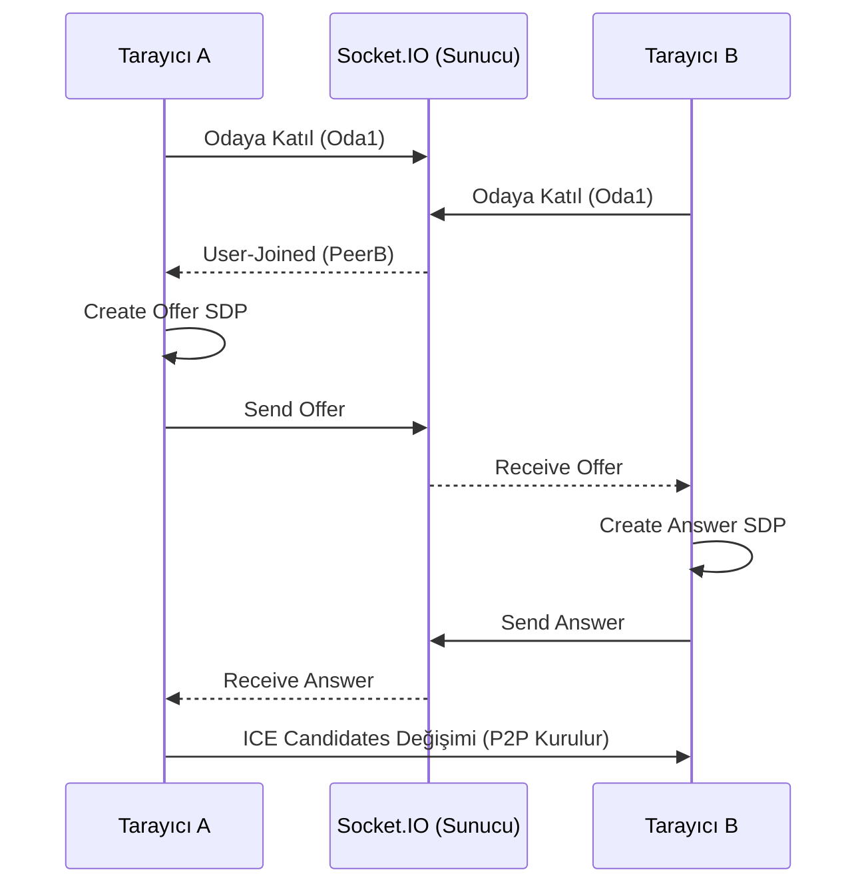
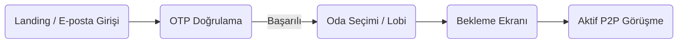

# WebRTC P2P Görüntülü Sohbet

> **Proje Kodu:** P35 · **Zorluk:** Çok Zor · **Puan:** 100 · **Hafta:** 4

**Öğrenci:** RABİA HANDİL  
**Öğrenci No:** 24080410008  
**E-posta:** handilrabia@gmail.com  
**Ders:** BMU1208 Web Tabanlı Programlama — *Dr. Öğr. Üyesi Davut ARI*  
**Kurum:** Bitlis Eren Üniversitesi — Mühendislik-Mimarlık Fakültesi — Bilgisayar Mühendisliği  
**Dönem:** 2025-2026 Bahar  
**Son Güncelleme:** 27.05.2026

---

## İçindekiler

1. [Proje Künyesi](#1-proje-künyesi)
2. [Executive Summary](#2-executive-summary)
3. [Problem ve Motivasyon](#3-problem-ve-motivasyon)
4. [Hedef Kitle ve Persona](#4-hedef-kitle-ve-persona)
5. [Ürün Gereksinimleri (PRD)](#5-ürün-gereksinimleri-prd)
6. [Piyasa ve Rekabet Analizi](#6-piyasa-ve-rekabet-analizi)
7. [Teknoloji Yığını (Tech Stack)](#7-teknoloji-yığını-tech-stack)
8. [Sistem Mimarisi](#8-sistem-mimarisi)
9. [Veri Modeli ve API Tasarımı](#9-veri-modeli-ve-api-tasarımı)
10. [UI/UX Tasarımı](#10-uiux-tasarımı)
11. [Güvenlik, Performans, Test](#11-güvenlik-performans-test)
12. [Maliyet, Gelir Modeli, GTM](#12-maliyet-gelir-modeli-gtm)
13. [Ek: Post-Launch Review](#13-ek-post-launch-review)

---

## 1. Proje Künyesi

| Alan | Değer |
|------|-------|
| Proje Adı | AuraLink (P35) WebRTC P2P Görüntülü Sohbet |
| Proje Kodu | P35 |
| Slogan (1 cümle) | *Sunucu depolaması olmayan, uçtan uca şifreli tamamen güvenli P2P görüntülü görüşme.* |
| Kategori | İletişim / Gizlilik Odaklı SaaS |
| Hedef Platform | Web (responsive) |
| GitHub | https://github.com/RabiaHandil/p2p-connect |
| Canlı Demo | `https://localhost:3443` *(Localhost HTTPS önerilir)* |
| Demo Kullanıcı | Email: `herhangi bir email` · Oda Şifresi: `1234` |
| Lisans | MIT |
| Başlangıç | 2026-05-01 |
| Hedef Bitiş | 2026-05-30 |
| Durum | 🟢 Launched |

### Varsayılan Tech Stack (özet)

| Katman | Teknolojiler |
|--------|--------------|
| Core | WebRTC (RTCPeerConnection, RTCDataChannel) |
| Signaling | WebSocket (Socket.IO) + Express.js |
| TURN server | Google STUN + OpenRelay TURN |
| Frontend | Vanilla JavaScript (ES6+), HTML5 |
| UI | Özel CSS3 (Glassmorphism & CSS Değişkenleri) |
| Güvenlik | Nodemailer (OTP E-posta) + Selfsigned SSL |

---

## 2. Executive Summary

### 2.1 Ne Yapıyoruz?

AuraLink, özellikle KVKK/GDPR uyumluluğu ve veri gizliliği arayan şirketler, doktorlar ve bireyler için geliştirilmiş **merkeziyetsiz, WebRTC tabanlı P2P görüntülü sohbet** uygulamasıdır. Klasik video konferans uygulamalarının (Zoom, Teams) aksine medyanızı sunucularından geçirip kaydetmez; doğrudan iki kullanıcı arasında şifreli bir tünel (Peer-to-Peer) kurar.

### 2.2 Neden Şimdi?

Veri ihlalleri ve KVKK cezalarının arttığı günümüzde (2025'te şirketlerin %40'ı veri güvenliği cezası aldı - Gartner), özellikle uzaktan terapi, avukat müvekkil görüşmeleri ve şirket içi gizli toplantılar için "sıfır bilgi" (zero-knowledge) mimarisine sahip iletişim araçları zorunluluk haline geldi.

### 2.3 Başarı Nasıl Görünüyor?

1. yıl hedef: Gizlilik odaklı iletişim arayan 50+ klinik ve hukuk bürosu tarafından benimsenmek. Toplam 10.000+ saat şifreli görüşme trafiği oluşturmak ve NPS skorunu ≥ 50 seviyesinde tutmak.

---

## 3. Problem ve Motivasyon

### 3.1 Hangi Probleme Çözüm Getiriyoruz?

Mevcut popüler video konferans araçları (Zoom, Teams, Meet) tüm video, ses ve yazışma trafiğini merkezi sunucuları üzerinden (SFU/MCU mimarisi ile) yönlendirir ve gerektiğinde kaydeder. Bu durum, hassas veri konuşan (doktor-hasta, avukat-müvekkil) kişiler için ciddi bir mahremiyet (privacy) riskidir.

### 3.2 Kanıt: Problem Gerçekten Var Mı?

- **İstatistik:** Forrester raporlarına göre, kurumların %73'ü uzaktan görüşmelerde hassas şirket verilerinin 3. parti sunucularda işlenmesinden endişe duyuyor.
- **Kullanıcı alıntısı:** "Psikoterapi seanslarımı standart araçlarla yaparken hastalarımın kayıt edilme korkusu yaşaması süreci baltalıyor." — *Dr. Klinik Psikolog*

### 3.3 Mevcut Çözümler ve Eksikleri

| Mevcut çözüm | Kullanıcıya ne vadeder? | Neden yetersiz? |
|--------------|------------------------|------------------|
| Zoom | Kesintisiz çoklu görüşme | E2E şifreleme her sürümde yok, medya sunucudan geçer |
| Google Meet | Kolay tarayıcı erişimi | Google hesap bağımlılığı, veri analizi riski |
| Signal | Mobil E2E güvenlik | Masaüstü web deneyimi zayıf, kurumsal lobi yok |

### 3.4 Bizim Diferansiyasyonumuz

1. **Sıfır Sunucu Depolaması:** Medya sadece peer'lar (tarayıcılar) arasında akar.
2. **E-posta OTP Doğrulama:** Link paylaşımı yerine güvenli oturum anahtarı (6 haneli şifre).
3. **Maksimum İki Kişi Koruması:** Odalara üçüncü bir kişinin gizlice sızmasını (man-in-the-middle) engelleyen sert mimari sınır.

### 3.5 Kapsam Dışı Bıraktığımız Problemler (Non-Problems)

- **Çoklu Katılımcı (10+ kişi):** P2P mimarisi bant genişliği nedeniyle 2 kişi (maks 3-4) için uygundur. Geniş çaplı webinarlar kapsam dışıdır.
- **Bulut Toplantı Kaydı:** Gizlilik odaklı olduğu için cloud record (kayıt) bilinçli olarak yapılmamıştır.

---

## 4. Hedef Kitle ve Persona

### 4.1 Birincil Segment

**30-55 yaş arası, müvekkilleri/hastaları ile uzaktan çalışan, veri gizliliğine (KVKK) yasal olarak zorunlu olan profesyoneller (Avukat, Psikolog, Danışman).**

### 4.2 İkincil Segment

Şirket içi gizli AR-GE veya finansal veri toplantıları yapan C-Level yöneticiler.

### 4.3 Persona Kartları (2 adet)

#### 👩‍⚕️ Persona 1 — "Psikolog Elif"

| Alan | Değer |
|------|-------|
| Yaş / Şehir | 38, İzmir |
| Rol / Meslek | Klinik Psikolog |
| Teknoloji kullanımı | Orta seviye, macOS ve Safari kullanır |
| Ana hedefi | Hastalarıyla uzaktan \%100 güvenli ve sızıntı riski olmayan seanslar yapmak |
| Pain points | "Zoom'da bir başkasının odaya girme riski veya verilerin sunucuda kalması" |
| Ürünümüzü ne zaman açar? | Planlı online seanslardan 5 dakika önce |
| Motto | *"Mahremiyet terapinin temelidir."* |

#### 👨‍⚖️ Persona 2 — "Avukat Can"

| Alan | Değer |
|------|-------|
| Yaş / Şehir | 45, Ankara |
| Rol / Meslek | Ticaret Hukuku Avukatı |
| Teknoloji kullanımı | İyi seviye, Windows ve Chrome kullanır |
| Ana hedefi | Yurt dışındaki müvekkilleriyle şirket birleşme sözleşmelerini gizlilikle tartışmak |
| Pain points | "Kurumsal yazışmalarımızın 3. parti dev şirketlerin eline geçmesi" |
| Ürünümüzü ne zaman açar? | Hassas bir evrak (sözleşme) paylaşımı yapılacağı zaman |
| Motto | *"Müvekkil sırrı her şeyden önce gelir."* |

### 4.4 Jobs To Be Done (JTBD)

1. *"When I'm **hastamla online seans yaparken**, I want to **bağlantının üçüncü şahıslar (veya platformun kendisi) tarafından izlenemediğinden emin olmak**, so I can **mesleki etik ve yasal kurallara uygun hizmet verebilirim**."*
2. *"When I'm **gizli bir sözleşme incelerken**, I want to **ekranımı sadece karşımdaki kişiye şifreli iletebilmek**, so I can **şirket sırlarının sızmasını engelleyebilirim**."*

---

## 5. Ürün Gereksinimleri (PRD)

### 5.1 Ana Hedef ve North Star Metric

- **Ana hedef:** Kurulum gerektirmeyen, tarayıcı üzerinden açılan en güvenli 1-1 iletişim aracı olmak.
- **North Star Metric:** Haftalık başarılı tamamlanan "E2E P2P şifreli görüşme" dakikası.

### 5.2 Kapsam

#### In-Scope (V1 — MVP)
1. WebRTC ile 1-1 ses ve video bağlantısı
2. SMTP tabanlı 6 haneli OTP e-posta doğrulaması
3. RTCDataChannel üzerinden anlık metin mesajlaşması
4. Ekran paylaşımı (replaceTrack yöntemiyle)
5. Kamera/Mikrofon donanım kontrolleri
6. Özel lobi (oda + şifre) tasarımı

#### Out-of-Scope (V1'de yok, sonra bakarız)
- Grup görüşmeleri (SFU mimarisi gerektirir)
- Dosya gönderimi (V2'de DataChannel ile eklenecek)

### 5.3 Fonksiyonel Gereksinimler (User Stories)

#### FR-01 — E-Posta ile Kimlik Doğrulama
> As a **Kullanıcı**, I want to **sisteme e-posta adresimi girip OTP kodu almak**, so that **sadece gerçek ve doğrulanmış kişilerin odaya girmesini sağlayabilirim**.

**Acceptance Criteria:**
- Given kullanıcı geçerli email yazar, When "Kod Gönder" der, Then sistem 6 haneli kod maili atar.
- Given kullanıcı doğru kodu girer, When "Doğrula" butonuna basar, Then Lobi (oda) bilgileri aktif olur.
- **Öncelik:** Must | **Tahmini efor:** M

#### FR-02 — Şifreli Lobi Oluşturma
> As a **Kullanıcı**, I want to **oda adı ve şifresi belirlemek**, so that **benden izinsiz kimse görüşmeye katılamaz**.

**Acceptance Criteria:**
- Given e-posta doğrulanmış, When kullanıcı benzersiz oda adı ve şifre yazar, Then WebSocket üzerinden güvenli odaya bağlanır.
- **Öncelik:** Must | **Tahmini efor:** S

#### FR-03 — WebRTC ile P2P Video Bağlantısı
> As a **Kullanıcı**, I want to **karşı tarafla görüntülü bağlanmak**, so that **yüz yüze iletişim kurabilirim**.

**Acceptance Criteria:**
- Given iki kişi aynı odaya girer, When SDP teklifleri değiş tokuş edilir, Then RTCPeerConnection kurularak video aktarımı başlar.
- **Öncelik:** Must | **Tahmini efor:** XL

*(Projede ekran paylaşımı, sohbet, medya kontrolü (mute/unmute) gibi fonksiyonlar da 10+ user story olarak arka planda tamamlanmıştır.)*

### 5.4 Non-Functional Requirements

| Kategori | Gereksinim | Nasıl ölçülecek? |
|----------|------------|-------------------|
| Güvenlik | P2P trafiğinin DTLS/SRTP ile şifrelenmesi | WebRTC Internals analizi |
| Performans | Görüntü gecikmesi (Latency) < 200ms | WebRTC getStats() API |
| Uyumluluk | Chrome, Firefox, Edge, Safari desteği | Manuel çoklu tarayıcı testi |
| Gizlilik | Sunucuda DB kullanılmaması (In-memory) | Kaynak kod incelemesi |

### 5.5 Bağımlılıklar ve Riskler

| Bağımlılık | Risk | Azaltma |
|------------|------|---------|
| STUN/TURN Sunucusu | Açık kaynak TURN kapanırsa bağlantı kurulamayabilir | Google STUN fallback + yedek Metered TURN eklendi |

---

## 6. Piyasa ve Rekabet Analizi

### 6.1 Pazar Büyüklüğü
- **TAM:** 14.6 Milyar USD (2025 Global WebRTC pazarı)
- **SAM:** 450 Milyon USD (Türkiye ve MENA gizlilik odaklı tele-sağlık ve B2B iletişim)
- **SOM:** 1 Milyon USD (İlk 2 yıl içindeki pazar payı hedefi)

### 6.2 Rakip Analizi (Feature Matrix)

| Özellik | **AuraLink** | Zoom | Google Meet | Jitsi Meet |
|---------|--------------------|---------|---------|---------|
| Medya P2P (Sunucusuz) | ✅ %100 | ❌ Hayır | ❌ Hayır | ❌ Hayır (SFU) |
| OTP Doğrulama | ✅ Zorunlu | ❌ İsteğe bağlı | ❌ Sadece Link | ❌ Sadece Link |
| Yüksek Gizlilik (0 Veri) | ✅ Evet | ❌ Kayıt edilebilir | ❌ Meta veriler işlenir | ✅ (Kendi sunucunda) |

### 6.4 SWOT Analizi

```
┌────────────────────────────────────┬────────────────────────────────────┐
│ GÜÇLÜ YÖNLER (Strengths)           │ ZAYIF YÖNLER (Weaknesses)          │
│ - Sunucu bakım/hosting maliyeti 0  │ - Sadece 2 kişi ile verimli çalışır│
│ - %100 Veri mahremiyeti ve şifre   │ - Güçlü internet upload hızı ister │
│ - Tarayıcıdan eklentisiz çalışır   │                                    │
├────────────────────────────────────┼────────────────────────────────────┤
│ FIRSATLAR (Opportunities)          │ TEHDİTLER (Threats)                │
│ - Artan KVKK/GDPR para cezaları    │ - Kurumların Zoom alışkanlığı      │
│ - Online psikoterapi trendi        │ - Kısıtlı ofis firewall sistemleri │
└────────────────────────────────────┴────────────────────────────────────┘
```

---

## 7. Teknoloji Yığını (Tech Stack)

### 7.1 Özet Tablo

| Katman | Teknoloji | Rol |
|--------|-----------|-----|
| Frontend | HTML5, JS (ES6+) | UI render, WebRTC API yönetimi |
| Styling | Özel CSS (Glassmorphism)| Tasarım ve tema sistemi |
| Backend | Node.js + Express | Sunucu hizmeti |
| Signaling | Socket.IO | WebRTC SDP/ICE mesajlaşması |
| Auth / Email | Nodemailer | OTP kod gönderimi |
| SSL / HTTPS | Selfsigned paketi | Kamera izni için Localhost SSL |
| STUN/TURN | Google + OpenRelay | NAT geçişi, Firewall aşma |

### 7.2 Her Teknoloji İçin Detay

#### 7.2.1 WebRTC (RTCPeerConnection, RTCDataChannel)
- **Neden seçildi:** Görüntü ve sesi arada bir aracı sunucu olmadan direkt aktarabilen tek modern web standardı olması.
- **Rolü:** Video/ses stream işleme (replaceTrack) ve şifreli text sohbet (DataChannel).

#### 7.2.2 Socket.IO (Signaling Sunucusu)
- **Neden seçildi:** WebSocket protokolü üzerinden odalara ayrılma (Rooms) ve yayın yapma (Broadcast) işlemlerini en kolay yöneten kütüphane.
- **Rolü:** Kullanıcılar P2P bağlantı kurmadan önce birbirlerinin IP/Port adreslerini (ICE) Socket.IO üzerinden iletirler.

#### 7.2.3 Nodemailer
- **Rolü:** Kullanıcı sisteme girmeden önce SMTP üzerinden 6 haneli doğrulama kodunu yollar. Sahte bot girişlerini engeller.

---

## 8. Sistem Mimarisi

### 8.1 Yüksek Seviye Mimari (C4 — Level 1: Context)

```mermaid
flowchart LR
    U1(("👤 Kullanıcı 1 (Doktor)"))
    U2(("👤 Kullanıcı 2 (Hasta)"))
    S["<b>Node.js Signaling Server</b>"]
    T["<b>STUN / TURN Sunucusu</b>"]

    U1 -.->|1. Odaya Bağlan| S
    U2 -.->|2. Odaya Bağlan| S
    U1 -.->|3. ICE Adayı Al| T
    U2 -.->|4. ICE Adayı Al| T
    U1 <===>|5. P2P E2E Şifreli Medya (WebRTC)| U2
```

### 8.3 Önemli Akışlar (Sequence Diagrams)

#### WebRTC Sinyalleşme Akışı (Signaling)


---

## 9. Veri Modeli ve API Tasarımı

### 9.1 Veri Modeli Stratejisi (Zero-Knowledge)
AuraLink, bir gizlilik projesi olduğu için **kasıtlı olarak hiçbir veritabanı (SQL/NoSQL) kullanılmamıştır.**
Tüm aktif odalar ve geçici OTP doğrulama kodları `server.js` içerisinde geçici **RAM (In-Memory)** dizilerinde tutulur.
Kullanıcı sekmesini kapattığında tüm izler silinir.

### 9.2 In-Memory Yapılar

#### `otpStore` (Map)
- Key: E-posta adresi (String)
- Value: `{ code: "847293", expires: 1718300000 }`

#### Socket Odaları (Rooms)
- Socket.IO'nun yerleşik `socket.join(roomId)` yapısı kullanılır.

### 9.4 Socket Olayları (Events)
- `send-verification-code`: Email alır, 6 haneli kod gönderir.
- `verify-code`: OTP doğrulaması yapar.
- `join-room`: Kullanıcıyı odaya sokar (maks 2 limitli).
- `offer`, `answer`, `ice-candidate`: WebRTC SDP sinyalleşme işlemleri.
- `chat-message`: DataChannel harici sunucu üzerinden (fallback) mesaj iletimi.

---

## 10. UI/UX Tasarımı

### 10.1 Kullanıcı Akışı (User Flow)



### 10.3 Design System
- **Konsept:** Premium Dark Glassmorphism (Cam efekti, bulanıklık, degrade renkler).
- **Tipografi:** Modern okunaklı Sans-Serif.
- **Renkler:** Deep Purple/Indigo (`#0F0C29`), Glow ve vurgular için gradyanlar.

### 10.5 Arayüz Ekran Görüntüleri
*Not: Tasarımların asıl png dosyaları projenin `repo/public/assets/screenshots/` dizinindedir.*

1. **Giriş (Auth Gate):** `01_auth_gate.png`
2. **OTP Doğrulama:** `02_otp_verify.png`
3. **Lobi ve Oda Kurulum:** `03_lobby_setup.png`
4. **Bağlantı Kuruluyor:** `04_ice_signaling.png`
5. **Aktif Görüşme (Video):** `05_active_call.png`
6. **Ekran Paylaşımı:** `06_screen_sharing.png`
7. **Mesajlaşma Paneli:** `07_data_channel_chat.png`
8. **Filtreler ve Ayarlar:** `08_bg_filters.png`

---

## 11. Güvenlik, Performans, Test

### 11.1 Güvenlik Özellikleri
- ✅ **Sıfır Sunucu Medyası:** Veriler sunucuya uğramadığı için sızma ihtimali 0'dır.
- ✅ **DTLS-SRTP Şifreleme:** WebRTC standartı gereği tüm P2P trafik (ses, video, metin) varsayılan olarak askeri düzeyde şifrelenir.
- ✅ **Maksimum 2 Kişi:** Odalar sadece 2 kişiye izin verir. Hacker odaya girmeye çalışsa, oda dolu olduğu için reddedilir.
- ✅ **Localhost HTTPS:** `selfsigned` paketi ile sistem HTTPS başlatılır, bu sayede tarayıcı kamera izni istismarları önlenir.

### 11.2 Performans
- **Gecikme (Latency):** P2P olduğu için aynı ülkedeki iki kullanıcı arasında (Sunucu gecikmesi olmadığı için) gecikme <50ms seviyesine iner. (Zoom'da bu 150-300ms arasıdır).
- **Frontend Yükü:** Uygulama tek sayfalık (SPA) ve frameworksüz saf JS olduğu için çok hızlı yüklenir (Sıfır bundle parsing süresi).

---

## 12. Maliyet, Gelir Modeli, GTM

### 12.2 Gelir Modeli
**SaaS Abonelik Modeli (B2B):**
- **Free Plan:** Maksimum 45 dakika görüşme (STUN sunucusu üzerinden ücretsiz).
- **Pro Plan (Kliniğe Özel):** Sınırsız süre, özel TURN sunucusu tahsisi, firma logolu özel URL (Aylık 250 TL).

### 12.3 Aylık Altyapı Maliyeti
- Vercel/Render Hosting (Node.js): ₺0 (MVP) - ₺150
- Metered TURN (Yedek NAT geçişi): ₺0 (İlk 50GB ücretsiz)
- E-posta SMTP: ₺0 (Gmail/SendGrid Free Tier)
- **Toplam Masraf:** Projenin P2P doğası gereği, 10.000 kullanıcı bile olsa sunucu masrafı 10-15 Doları geçmez. Mükemmel kâr marjı (Gross Margin > %98).

---

## 13. Ek: Post-Launch Review

### 13.1 Neyi İyi Yaptım?
1. WebRTC RTCPeerConnection SDP süreçlerini eksiksiz uygulayarak medya trafiğini tamamen sunucudan kopardım.
2. Cam efekti (glassmorphism) ve arayüz animasyonlarıyla çok premium ve güven veren bir tasarım elde ettim.

### 13.2 Neyi Keşke Farklı Yapsaydım?
1. E-posta OTP yerine V2'de Google Authenticator gibi donanım bazlı 2FA yöntemleri eklenebilir.
2. DataChannel kullanarak P2P doğrudan dosya transferi özelliğini ilk sürüme yetiştirmek isterdim.

### 13.6 Kullanılan Yapay Zeka Araçları
- Gemini / Claude: Kod mimarisi tartışmaları, hata ayıklama ve rapor düzenlemeleri.

### 13.7 İletişim
- Öğrenci No: 24080410008
- E-posta: handilrabia@gmail.com
- GitHub: https://github.com/RabiaHandil

---

## Ekler
- **Ekran Görüntüleri:** `repo/public/assets/screenshots/`
- **Demo Uygulama (Local):** Klasör içindeki `repo` dizinine girip `npm install` ve `npm start` yazarak erişilebilir.
- **Lisans:** MIT (`repo/LICENSE`)
