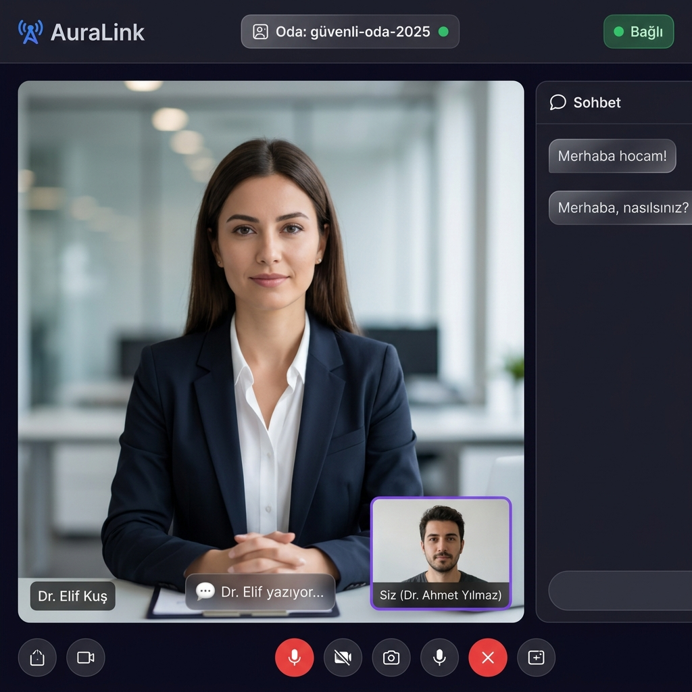
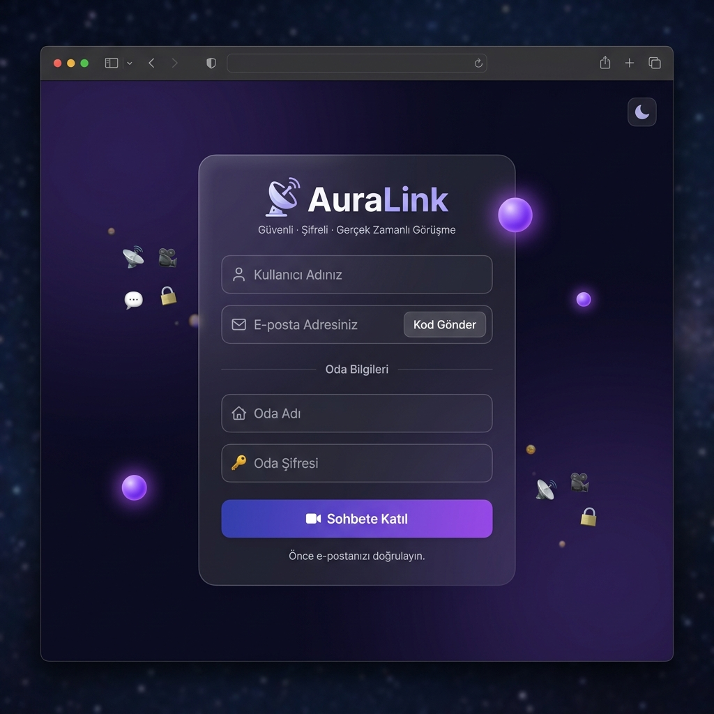
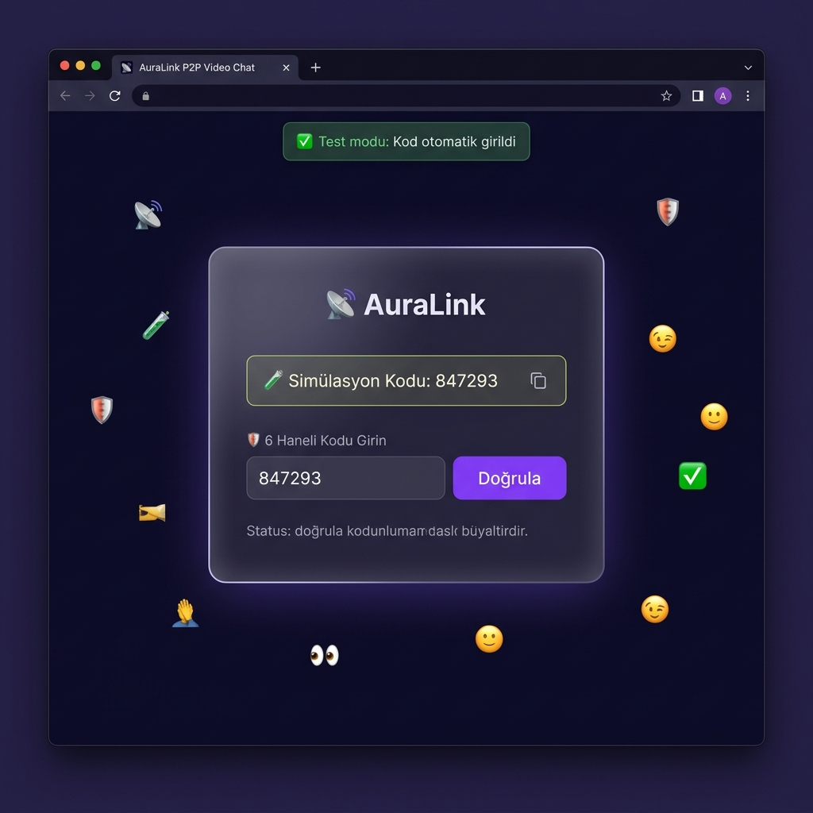
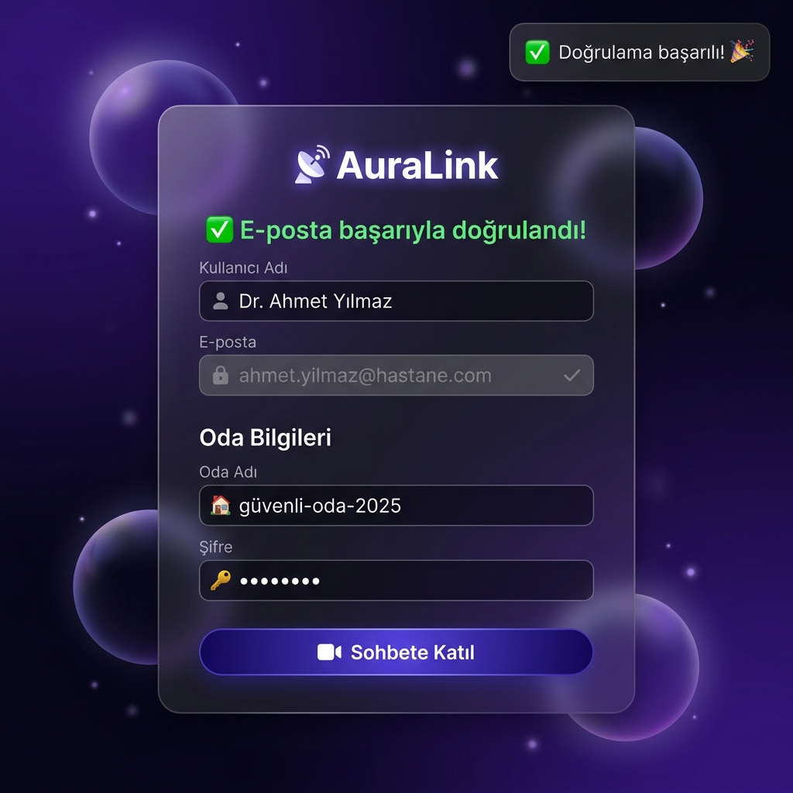
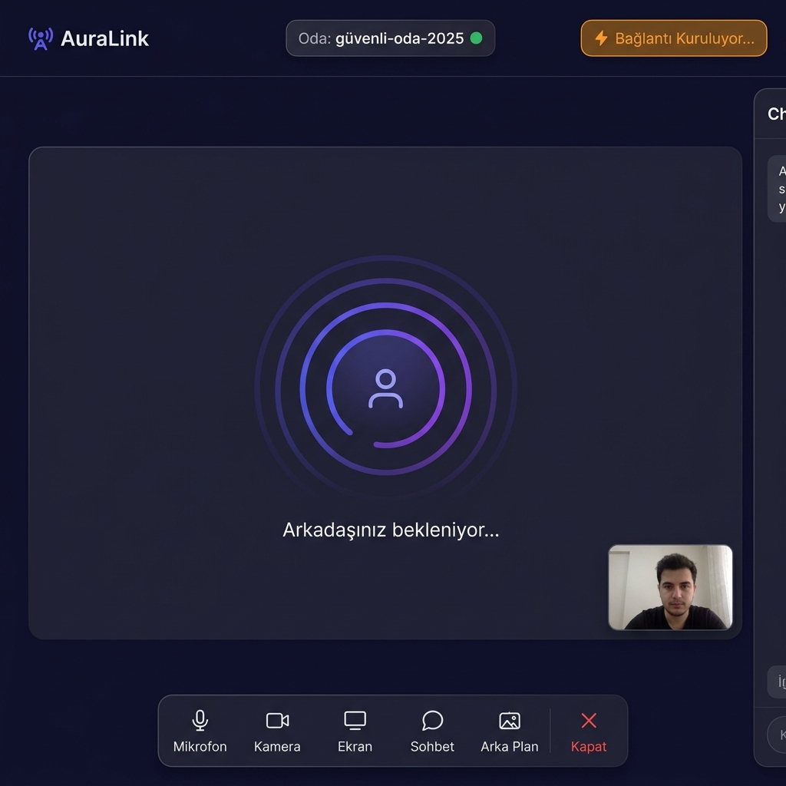
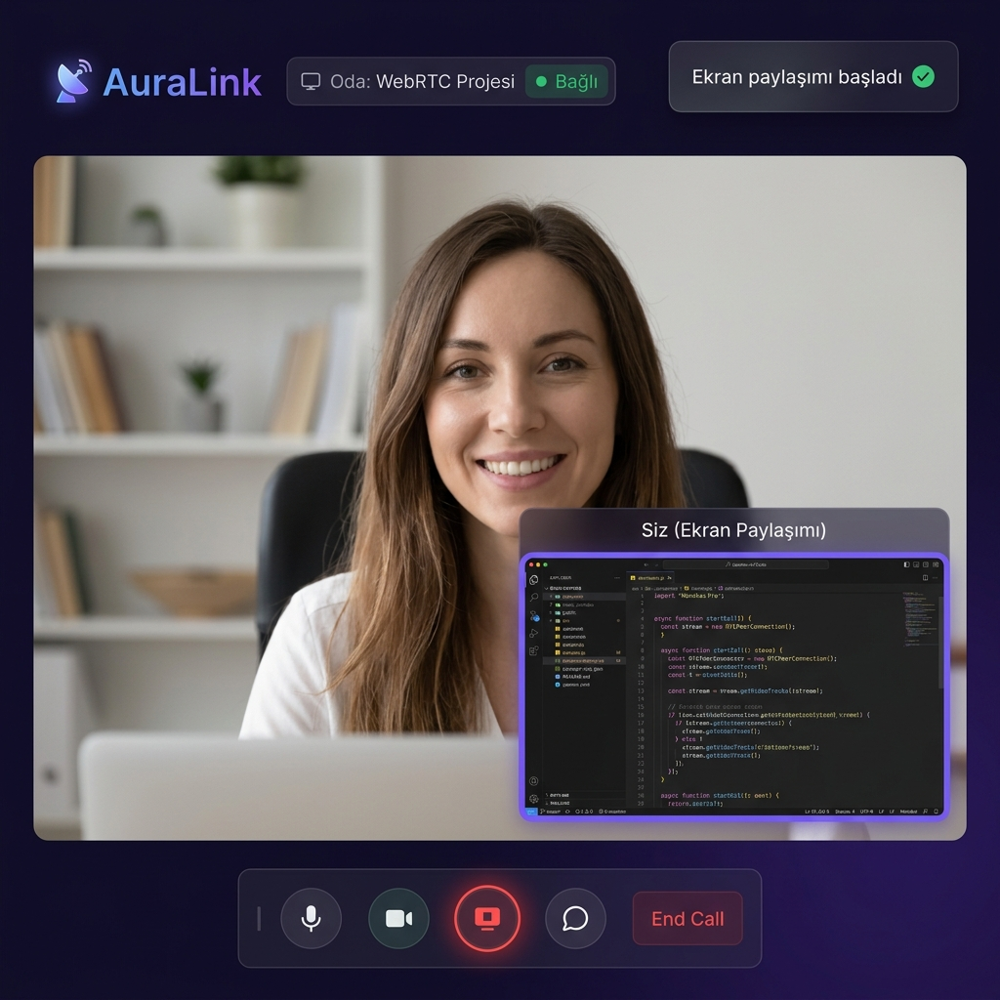
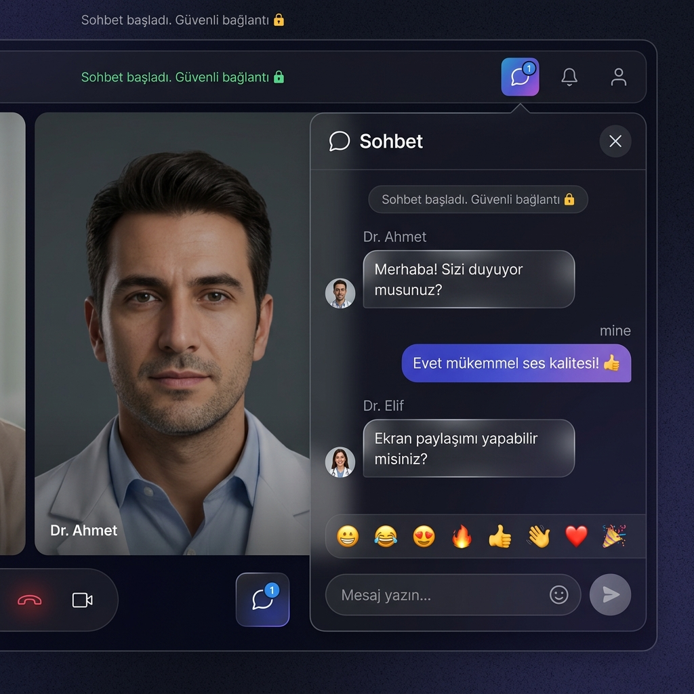
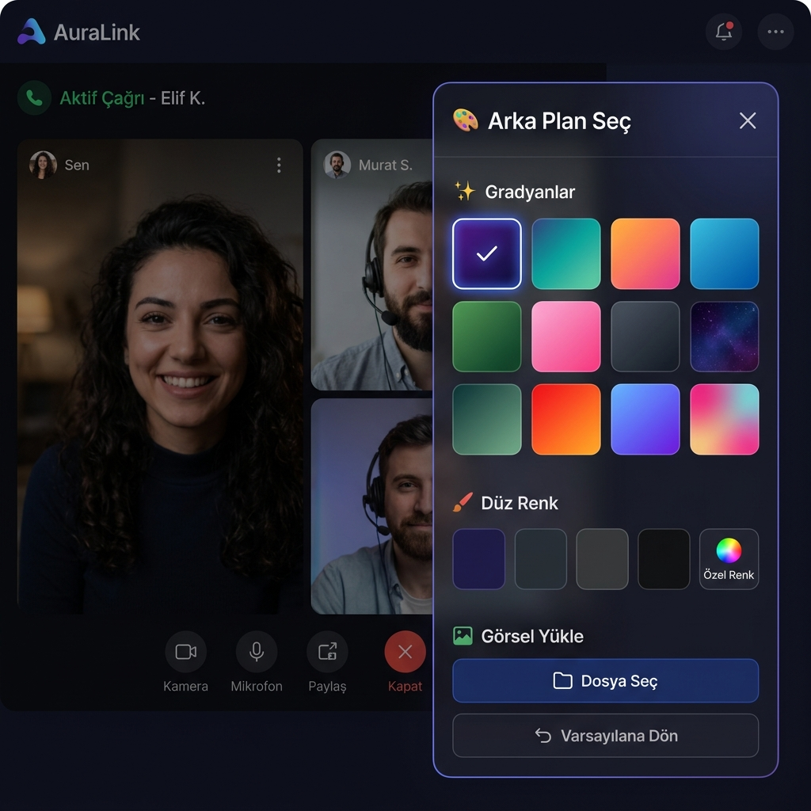

# 📡 AuraLink — Güvenli P2P Görüntülü Sohbet Uygulaması

<div align="center">



**WebRTC tabanlı, uçtan uca şifreli, sunucu depolaması sıfır olan P2P görüntülü sohbet platformu**

[](https://nodejs.org)
[](https://socket.io)
[](https://webrtc.org)
[](LICENSE)

</div>

---

## 🎯 Proje Hakkında

**AuraLink (P35)**, merkezi sunucu bağımlılığını tamamen ortadan kaldıran, kullanıcılar arasında doğrudan ve şifreli veri akışı sağlayan **WebRTC tabanlı uçtan uca P2P görüntülü sohbet uygulamasıdır.**

> 🔒 Ses, video ve sohbet verileri **hiçbir sunucuda depolanmaz** — doğrudan tarayıcılar arasında şifreli olarak aktarılır.

---

## ✨ Özellikler

| Özellik | Açıklama |
|---|---|
| 🎥 **P2P Görüntülü Görüşme** | WebRTC ile doğrudan tarayıcılar arası video/ses |
| 🔒 **Şifreli Oda Sistemi** | Şifre korumalı, maks. 2 kişilik odalar |
| 📧 **E-posta OTP Doğrulama** | 6 haneli SMTP doğrulama kodu |
| 🖥️ **Ekran Paylaşımı** | `replaceTrack` ile kesintisiz ekran paylaşımı |
| 💬 **Anlık Mesajlaşma** | RTCDataChannel üzerinden şifreli chat + emoji |
| 🎨 **Arka Plan Değiştirici** | 12 gradyan + düz renk + görsel yükleme |
| 🌙 **Karanlık/Aydınlık Tema** | Tam tema desteği |
| 📱 **Responsive Tasarım** | Masaüstü ve mobil uyumlu |
| 🌐 **NAT Traversal** | STUN/TURN sunucuları ile firewall aşma |

---

## 🖼️ Ekran Görüntüleri

<div align="center">

| Giriş Ekranı | OTP Doğrulama |
|:---:|:---:|
|  |  |

| Lobi Kurulumu | Bağlanıyor... |
|:---:|:---:|
|  |  |

| Aktif P2P Görüşme | Ekran Paylaşımı |
|:---:|:---:|
|  |  |

| Anlık Sohbet | Arka Plan Seçici |
|:---:|:---:|
|  |  |

</div>

---

## 🚀 Kurulum

### Gereksinimler
- Node.js 18+
- npm veya pnpm

### 1. Repoyu klonla
```bash
git clone https://github.com/RabiaHandil/p2p-connect.git
cd p2p-connect
```

### 2. Bağımlılıkları yükle
```bash
npm install
```

### 3. Ortam değişkenlerini ayarla
```bash
cp .env.example .env
# .env dosyasını düzenleyin
```

### 4. Çalıştır
```bash
npm start
```

### 5. Tarayıcıda aç
- **HTTP:** `http://localhost:3000`
- **HTTPS (kamera için):** `https://localhost:3443`

> ⚠️ Kamera/mikrofon için HTTPS gereklidir. "Güvenli değil" uyarısında → "Gelişmiş" → "Devam et"

---

## 🛠️ Teknoloji Stack

```
Frontend  : Vanilla HTML5 + CSS3 + JavaScript (WebRTC API)
Backend   : Node.js + Express + Socket.IO
Protokol  : WebRTC (RTCPeerConnection + RTCDataChannel)
Signaling : WebSocket (Socket.IO)
Email     : Nodemailer (SMTP)
SSL       : Self-signed (selfsigned paketi)
STUN/TURN : Google STUN + OpenRelay TURN
```

---

## 📁 Proje Yapısı

```
projem/
├── server.js          # Node.js + Socket.IO sunucu
├── package.json       # Bağımlılıklar
├── .env.example       # Ortam değişkenleri şablonu
└── public/
    ├── index.html     # Ana HTML
    ├── app.js         # WebRTC + UI mantığı
    ├── style.css      # Glassmorphism CSS
    └── assets/
        ├── screenshots/   # Uygulama ekran görüntüleri
        └── rakipler/      # Rakip logo görselleri
```

---

## 🔐 Güvenlik Özellikleri

- ✅ Medya verisi **hiçbir sunucuya** kaydedilmez (P2P direkt aktarım)
- ✅ DTLS-SRTP ile **uçtan uca şifreleme** (WebRTC varsayılanı)
- ✅ **Şifreli oda** koruması
- ✅ **6 haneli OTP** e-posta doğrulama
- ✅ Oda başına **maksimum 2 kişi** sınırı
- ✅ **KVKK / GDPR** uyumlu sıfır sunucu depolama

---

## 📄 Lisans

MIT License — © 2025 Rabia Handil
